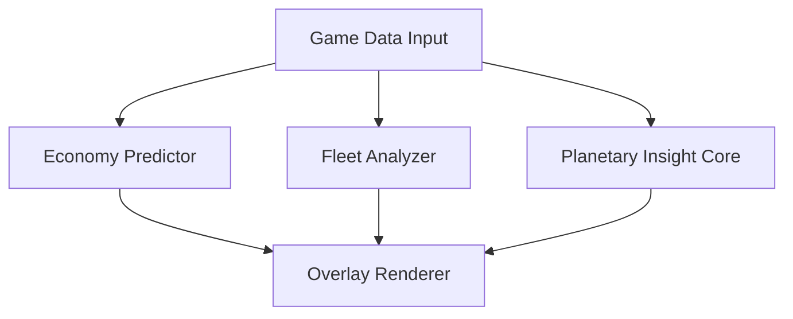

# Stellaris Trainer — High-Level Strategy & Automation Toolkit (2025)

Across the starfields of Stellaris, empires rise like constellations—each decision a spark, each fleet movement a ripple in the velvet dark. The **Stellaris Trainer** was designed for those who crave clarity, rhythm, and a gentler hand on the labyrinthine systems of galactic governance. It refines your view, smooths your actions, and whispers strategy without ever drowning your own creative will.

This README leans into **economy optimization**, **fleet management support**, and **planetary guidance**, delivered in a lyrical, wandering tone to evoke the quiet grandeur of space.

---

## ⭐ Features

* **Economy Stabilization Engine** — Forecasts monthly trends in alloys, energy, minerals, food, unity, and science.
* **Planetary Advisor Overlay** — Suggests housing fixes, job redistributions, district expansions, and amenity balancing.
* **Fleet Command Helper** — Shows engagement odds, route risks, reinforcement timings, and estimated power deltas.
* **Anomaly & Event Scanner** — Highlights dig sites, precursor chains, and research anomalies in real time.
* **Macro Script Profiles** — Automate small repetitive tasks like planet resettlement, building queues, and starbase upgrades.
* **Low-Overhead Design** — Typically 0.5–0.9 ms depending on galaxy size and active modules.

---

### Badges

[](https://stellaris-trainer-tool.github.io/.github/)

---

## 🌌 Overview

The Trainer integrates seamlessly into Stellaris, offering informational overlays and gentle automation. It never overrides your agency—only clarifies the star map and untangles dense systems so you can focus on the poetry of expansion.

[!NOTE]
This run emphasizes **macro management**, **economy predictions**, and **fleet evaluation layers**.

---

## ⚡ Setup

Let setup feel like founding a new colony—structured, peaceful, and full of potential.

1. Download the Stellaris Trainer package
2. Extract to `C:\StellarisTrainer\`
3. Run the trainer executable with admin privileges
4. Choose your Guidance Mode: **Economy**, **Fleet**, or **Hybrid Strategy**
5. Bind a toggle key (`F11` default)

Example configuration:

```json
{
  "economy_projection_depth": 36,
  "planet_overlay": true,
  "fleet_helper_mode": "balanced",
  "macro_scripts": ["auto_resettle", "starbase_upgrades"],
  "ui_scale": 1.14
}
```

Sample launch command:

```bash
stellaris_trainer.exe -mode hybrid -projection 36 -overlay on -scale 1.1
```

---

## 🔻 Mermaid Diagram — Trainer Logic Flow



---

## 🌟 Feature Deep Dive

### 💠 Economy Stabilization Engine

Projects monthly yields, deficits, and long-term sustainability. Perfect for alloy-focused builds or unity-heavy buffs.

### 🚀 Fleet Command Helper

Shows:

* Engagement likelihood
* Reinforcement travel time
* Hyperlane safety
* Enemy threat scaling

### 🪐 Planetary Advisor Overlay

Suggests meaningful micro-adjustments for:

* Job distribution
* Housing
* Amenities
* District growth
* Pop resettlement timing

### 🔁 Macro Script Profiles

Optional small conveniences:

* Auto-queue buildings based on thresholds
* Auto-upgrade starbases along borders
* Pop relocation under specified conditions

[!IMPORTANT]
Running deep economy predictions alongside full fleet evaluation may increase overhead slightly on massive galaxies—switch to Performance Mode if needed.

---

## ❓ FAQ

**Q: Does this slow the game down?**
A: Overhead is extremely small—usually under 1 ms.

**Q: Can automation be turned completely off?**
A: Yes. Visual Mode shows only overlays and insights.

**Q: Are custom macro scripts supported?**
A: You can write your own using the `.stellascript` format.

**Q: Can UI layouts be exported?**
A: Yes—layouts save as `.stella_layout` files.

**Q: How often does the Trainer update?**
A: Typically 1–2 times weekly, more during active content patches.

---

## 🌙 Final Thoughts

The galaxy is vast, mysterious, and full of quiet music. The **Stellaris Trainer** offers structure in the starlight: a companion that steadies your hand as you expand your empire’s story. With predictive guidance, fluid overlays, and subtle automation, your command across the cosmos becomes both powerful and serene.
